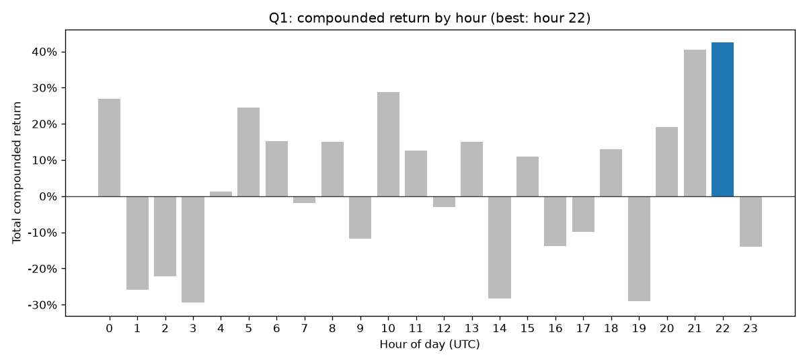
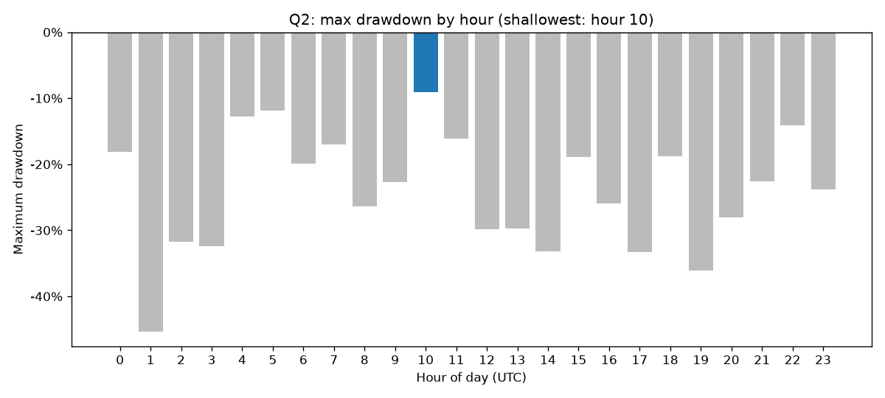

# Bitcoin Backtesting Engine

Intraday Bitcoin strategy backtester, built with dbt on Postgres. One command runs the full thing.

Strategy: buy at the first second of a chosen hour, sell at the last second of that same hour,
reinvesting all proceeds daily. Two questions: which hour had the biggest compounded return,
and which had the lowest maximum losses.

## Contents

- [Prerequisites](#prerequisites)
- [Quick start](#quick-start)
- [Results](#results)
- [How it works](#how-it-works)
- [Implementation thoughts](#implementation-thoughts)
- [Buy and sell prices](#buy-and-sell-prices)
- [Assumptions](#assumptions)
- [Stack](#stack)
- [What I'd do next](#what-id-do-next)

## Prerequisites

**Docker** is the only thing to set up: install it ([Docker Desktop](https://docs.docker.com/get-docker/) on macOS/Windows; [Docker Engine](https://docs.docker.com/engine/install/) on Linux) and make sure it is running. `run.sh` checks for it.

Everything else is handled: `run.sh` auto-installs [uv](https://docs.astral.sh/uv/) if missing, and uv reads the committed lockfile to provision Python and dbt. No separate Python or dbt setup.

## Quick start

1. Clone and enter:

   ```bash
   git clone https://github.com/Datarogie/wooly-binance-backtest.git
   cd wooly-binance-backtest
   ```

2. Put the dataset CSV in the project root (any `.csv` filename works; the loader
   auto-detects the single CSV, and it is never committed):

   ```bash
   kaggle datasets download -d tzelal/binance-bitcoin-dataset-1s-timeframe-p2 --unzip -p .
   ```

   or download and unzip manually from the Kaggle dataset page.

3. Run everything:

   ```bash
   bash run.sh
   ```

`run.sh` checks Docker and uv, starts Postgres, loads the data, builds and tests the
models, prints the answers, and writes the charts to `docs/screenshots/`.

### Running steps individually

| command | does |
| --- | --- |
| `make up` / `make down` | start / stop Postgres |
| `make load` | load the dataset into `raw.bitcoin_prices` |
| `make deps` | install dbt packages |
| `make build` | `dbt deps` then `dbt build` |
| `make test` | run dbt tests |
| `make answers` | print the answers from the built marts |
| `make all` | full pipeline: up, load, build, answers |
| `make lint` / `make format` | sqlfluff lint / fix |
| `make charts` | write the Q1 / Q2 answer charts to `docs/screenshots/` |

The `Makefile` exports `DBT_PROFILES_DIR`. To run dbt directly:
`uv run dbt build --profiles-dir .`

### Developing

```bash
uv sync                      # create .venv
source .venv/bin/activate    # or use direnv (committed .envrc)
```

`bash scripts/setup.sh` does the one-time setup (venv + dbt packages) and enables
direnv if installed. The committed `.envrc` activates the venv and exports
`DBT_PROFILES_DIR` on `cd`. SQL style rules live in
[`docs/style-guide.md`](docs/style-guide.md), enforced by `make lint` / `make format`.

## Results

Over the sample (2021-02-23 to 2024-08-27, UTC): **Q1 is hour 22, about +42.5%**
compounded; **Q2 is hour 10, about -9%** maximum drawdown (the shallowest).

`run.sh` writes both charts to `docs/screenshots/` (or run `make charts`) via a small
matplotlib script (`scripts/make_charts.py`) over `fct_strategy_by_hour`, and prints a
clickable link to each PNG.





I first wired the marts for [Lightdash](https://www.lightdash.com) (the column
metadata is still in `models/marts/_marts__models.yml`), but its local self-host is
heavier to stand up than it used to be, so for a one-off I pivoted to the matplotlib
script.

## How it works

Three layers, each in its own schema:

- **staging** (views): `stg_binance__bitcoin_prices` cleans the one-second bars
  (drops exact duplicate rows, type casts, aliases). Close to source, no business logic.
- **intermediate**: `int_bitcoin__hourly_bars` resamples the deduped seconds to hourly
  OHLCV (open = first, high = max, low = min, close = last, volume = sum), materialized
  as a `table` since it is the one expensive query. The strategy models
  (`int_bitcoin__strategy_daily_trades`, `int_bitcoin__strategy_equity_curve`) are
  ephemeral: simulate trades, then compound.
- **marts** (tables): `fct_bitcoin_hourly_bars` is a thin view over the hourly bars.
  `fct_strategy_by_hour` is a 24-row aggregate, one per hour, holding both the Q1 return
  measures and the Q2 drawdown measures.

Answers come from `analyses/answer_strategy_questions.sql` (`make answers`).

## Implementation thoughts

The why behind the calls, by layer. The models show the what.

**Staging.** The one real call was duplicate rows: the source repeats some seconds
verbatim, so I drop them with `select distinct`, not a `row_number` filter, since
distinct only removes fully identical rows and can't merge two genuinely different
prints in the same second. In a real pipeline I would fix this at ingestion, not the
warehouse. Prices are `numeric` not float so rounding doesn't compound over thousands
of days. One cost to flag: the `unique` test scans ~110M rows and takes minutes; in
production I would enforce the key with a primary-key constraint at ingestion (and
reach for a unique index, monthly partitioning, or a BRIN index on `event_at`) and
drop the test.

**Intermediate.** Small steps that build on each other, each independently testable:
resample, simulate, compound.

- *Hourly bars* roll seconds up to the hour, mostly for scale (one row per second per
  symbol doesn't hold up once you picture every crypto). It is the only table in the
  layer, the one heavy collapse: do it once, everything downstream stays cheap.
  Open/close are first/last by time, not min/max, hence `array_agg`. I model only the
  hours that actually traded (sparse); a no-trade hour is identical to a no-change day
  (growth factor 1.0), so a calendar spine would be machinery for a presentation
  concern. Want a gapless chart axis? Forward-fill in the BI layer.
- *Daily trades* keep the pricing modular. A trade needs a real price at both ends, so I
  only trade hours with an actual bar at the first second and the last second; the rest
  are dropped, not back-filled. A price at :50 doesn't mean the price held at :59, so
  carrying one forward would invent a fill that never happened. Fees are one variable,
  frictionless to realistic in a switch.
- *Equity curve* keeps the compounding separate. Reinvesting compounds (each day
  multiplies the balance), so it isn't a running sum. Postgres has no running-multiply,
  and the standard trick is `exp(sum(ln(...)))`, so that is what I used.

**Marts.** Two facts, split on purpose. `fct_bitcoin_hourly_bars` is the OHLCV surface;
`fct_strategy_by_hour` is the 24-row strategy result holding both Q1 (return) and Q2
(drawdown). I nearly shipped Q1 and Q2 as two models, then merged them: same grain,
same source, overlapping columns. Return and risk are two reads of one process, not
two. The hourly-bars mart stays separate because it is a genuinely different grain. The
rule: one fact per process per grain.

Two analyses answer the question. `answer_strategy_questions.sql` reads the mart for the
fixed full-history answer. `answer_strategy_questions_windowed.sql` pushes the
compounding into the query with an editable start date, since the winning hour can move
with the window. I report the full-history one.

## Buy and sell prices

- **Buy = open of the hour's first second bar** (`[HH:00:00, HH:00:01)`), the first trade at the start of the hour.
- **Sell = close of the hour's last second bar**, the last trade before the hour ends.

An hour is only traded when a real bar exists at both boundary seconds (`has_open_boundary`
and `has_close_boundary` on the hourly bars). Hours missing either are dropped, not
back-filled: a price at `:50` doesn't imply the price at `:59`, so carrying one forward
would invent an entry or exit that never traded.

## Assumptions

Where the brief was ambiguous, the calls are in
[`docs/assumptions.md`](docs/assumptions.md). Key ones: all analysis is UTC; prices are
`numeric` not float; the backtest is frictionless by default with an optional
`fee_basis_points` variable; answers are sample-period-dependent (2021-02-23 to
2024-08-27).

## Stack

dbt Core 1.x on Postgres, managed with uv. Pinned to `dbt-postgres==1.10.0`
(dbt Fusion / Core 2.0 does not yet support the Postgres adapter).

## What I'd do next

- CI: sqlfluff lint + dbt unit tests on PRs against an ephemeral Postgres.
- Parameterized resample macro (minute / 4-hour / day bars).
- Incremental resample and drawdown for a live append-only feed.
- Day-of-week slicing via a `dim_date`. The feed is BTCUSDT only, so the models stay
  single-asset; more symbols would mean a `dim_symbol` and a grain change, but that is
  hypothetical against this dataset.
- Risk-adjusted ranking (e.g. deflated Sharpe for the 24-hypothesis correction).
- dbt Fusion once its Postgres adapter ships.
